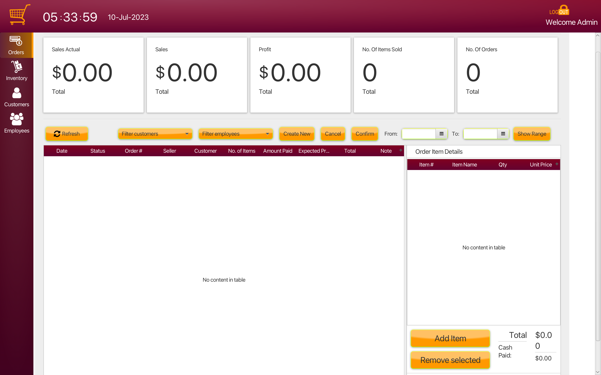
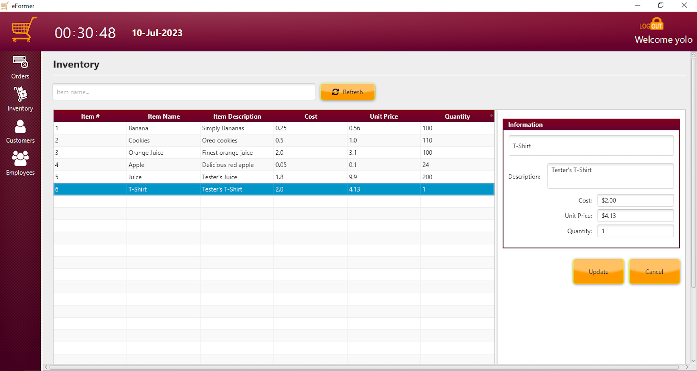
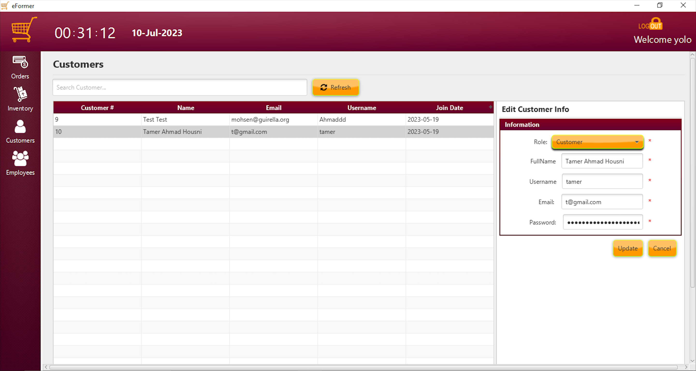
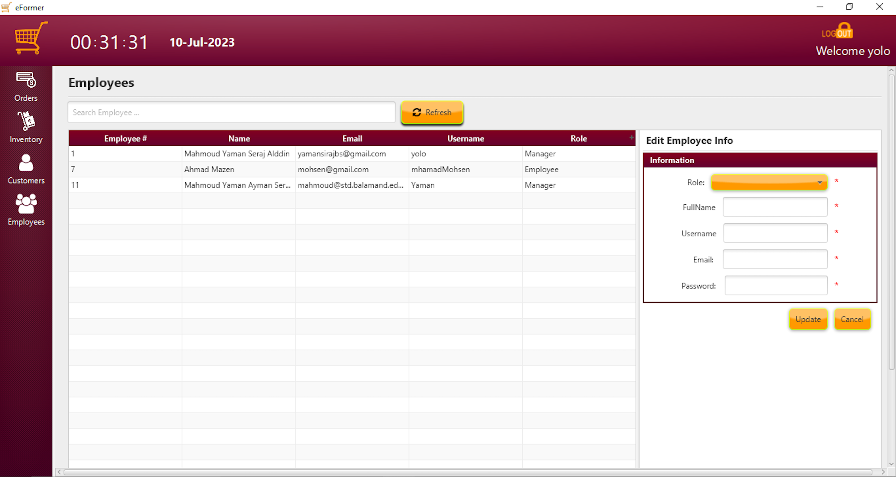

# 🛒 eFormer

eFormer is a simple eCommerce dashboard application that consists of a frontend and a backend. The backend is built using Spring Boot, Hibernate, and Spring Security, providing REST APIs for interaction. The frontend is developed using JavaFX and relies on the APIs provided by the backend.

## Features

- User authentication and authorization using Spring Security.
- RESTful APIs for managing products, orders, and user information.
- JavaFX interface to demonstrate the APIs

## Technologies Used

**- Backend:**
  - Spring Boot
  - Hibernate
  - Spring Security

**- Frontend:**
  - JavaFX

## Requirements

Before running the project, ensure you have the following installed:

- JDK: v20
- Maven: v3.6.3

## Getting Started

Make sure there are no applications using ports 8080 & 3306.
Navigate to the root directory then:

**1. Backend:**
  - Navigate to the Backend directory: `cd Backend`
  - Run `mvn spring-boot:run`
  - Allow incomming connections, if asked. 
  - Now the server is running & the APIs should function properly

**2. Frontend:**
  - Navigate to the Frontend directory: `cd Frontend`
  - Run `mvn javafx:run`
  - By default there is only one account, the Admin:
    - Username: Admin
    - Password: 123456789
    - This user can be used to create other accounts.

## Screenshots

